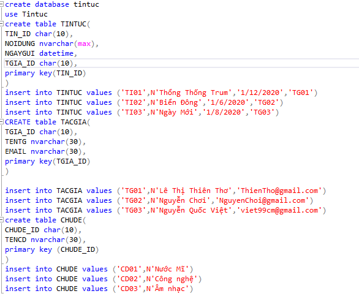
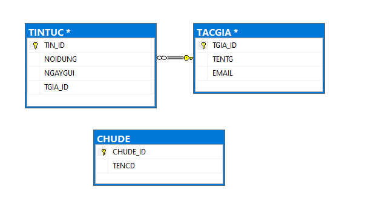
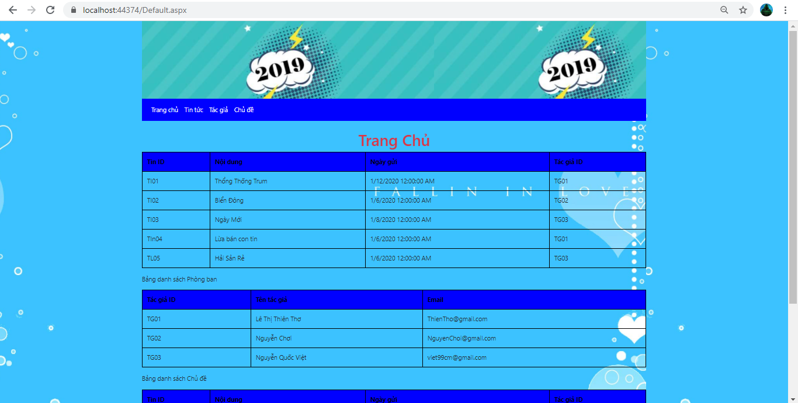
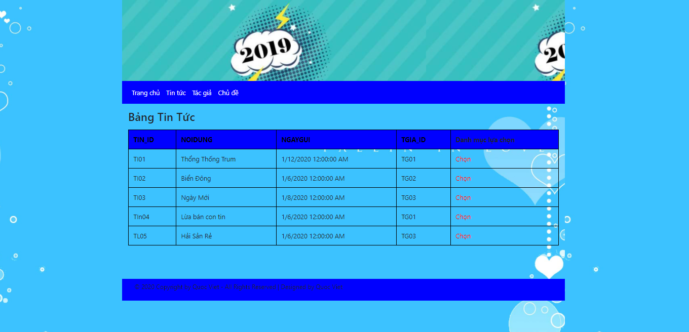
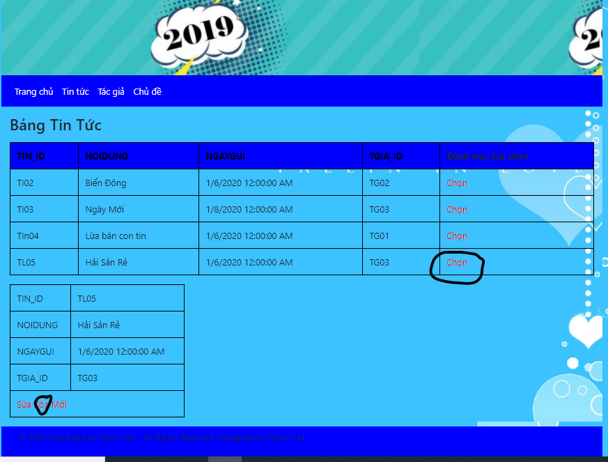
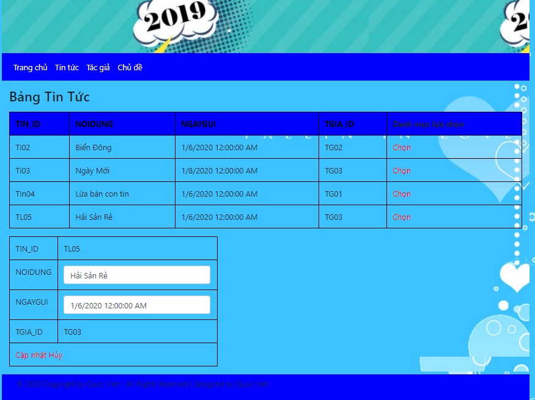
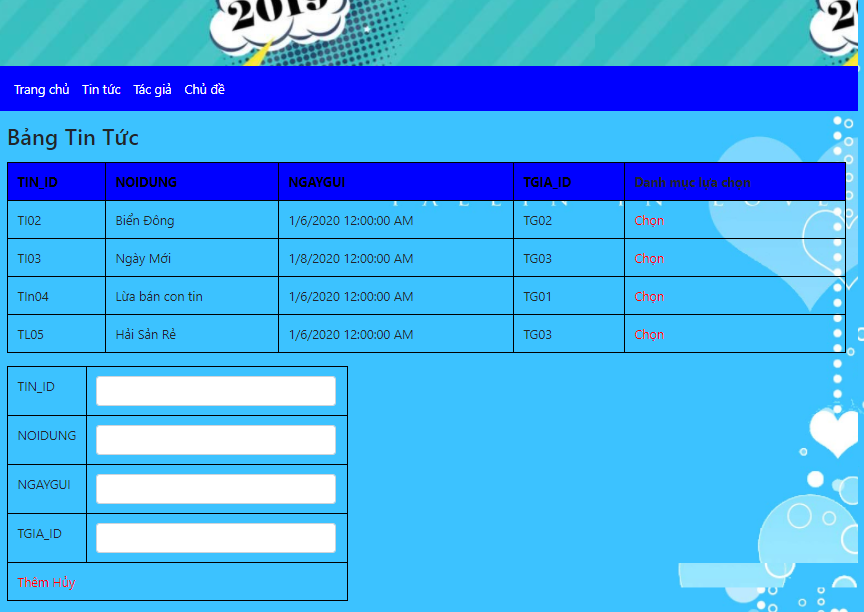
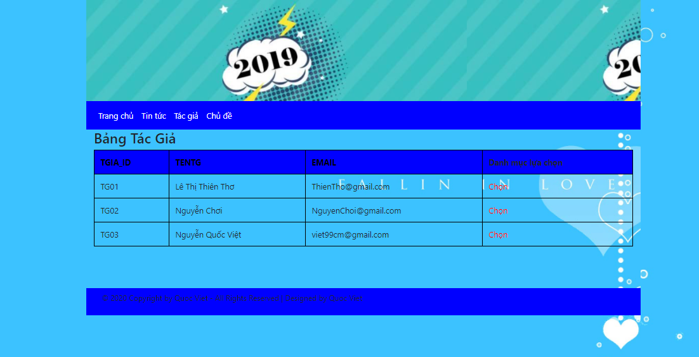
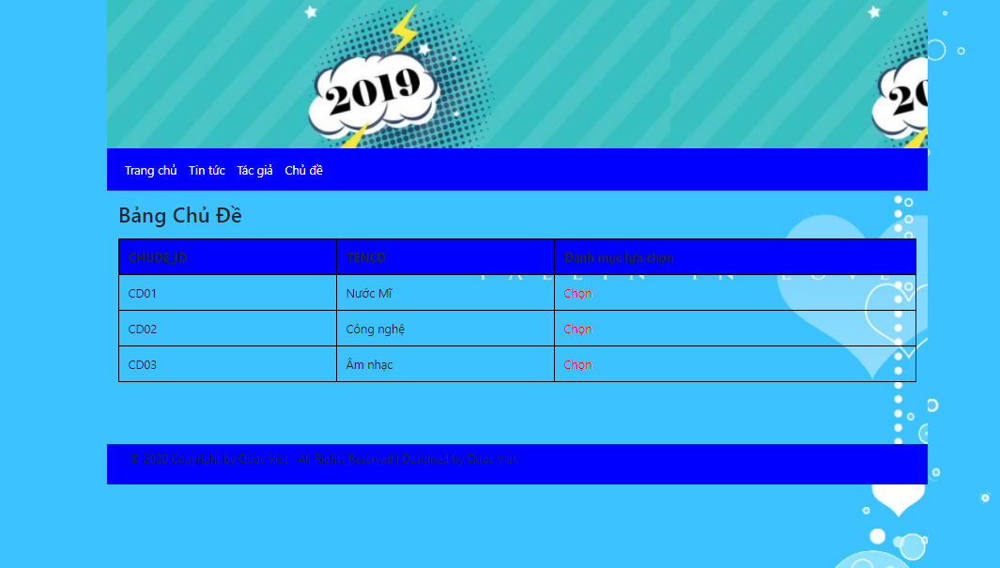

# Thông Tin
- Ho Tên : Nguyễn Quốc Việt
- Lớp : CTT12CD3A
- Thi Môn : Xây Dựng WebSite Thương Mại
- Ngày Thi : 28/12/2020

# Nội Dung Trang Web

## Tạo Cơ Sỡ Dữ Liệu

- Mở File  quanlytintuc.sql

## Tạo Mối Quan Hệ

## Dao Diện Tang Chủ

## Dao Diện Trang Tin Tức

- Tính Năng Xóa

- Tính Năng Sữa

- Tính Năng Thêm

## Dao Diện Trang Tác Giả

## Dao Diện Trang Chủ Đề

# Hết

